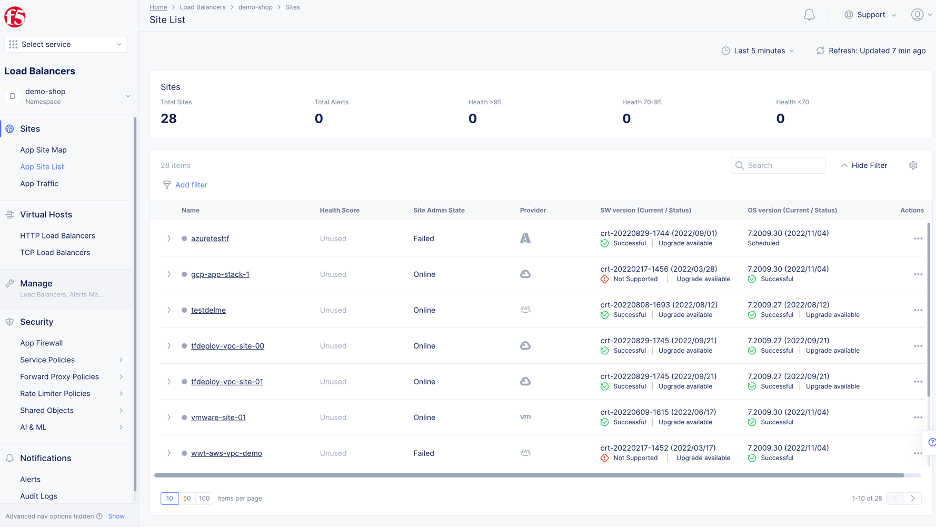
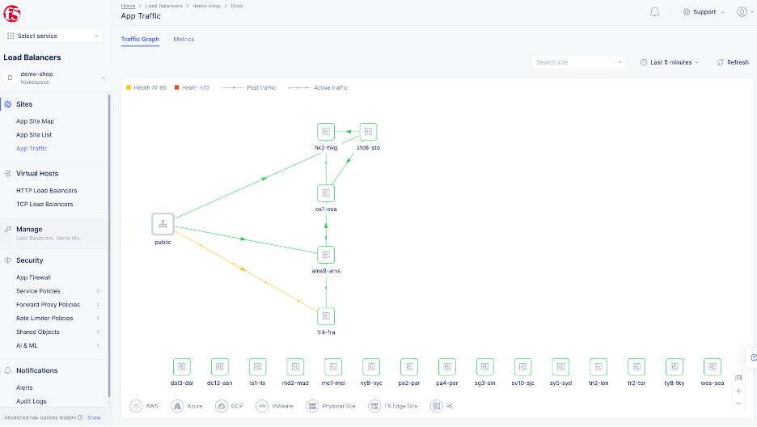

## Validation of Performance Dashboard

F5 Distributed Cloud Services (F5XC) Dashboard shows common services, organized into sections of **Cloud and Edge Sites**, **Distributed Apps**, **CDN**, **DNS**, and more. Under Distributed Apps at the top level, consider *HTTP Load Balancers* deployed in any given namespace. Metrics exposed from these load balancers to the dashboards include error and request rates; latency in milliseconds – chunked into client latency, server latency, and app latency – as well as the overall aggregated latency total; and throughput, both upstream and downstream. 

Further within a **Distributed Apps** namespace, the F5XC Dashboard contains a Cloud and Edge Sites section. Drilling to App Site list within shows the sites which are “stitched together” via one or more F5XC Regional Edges (RE). A site is a physical or cloud location where F5 CloudMesh Nodes are deployed, and can be public cloud, physical datacenter, or an edge location.

Telemetry regarding these sites is collected from the F5XC REs and exposed within the dashboard includes an overall System Health score, throughput both in and out, connectivity status as latency, data plane reachability (percentage), and in/out drop rates in packets per second.

The provided metrics give a holistic view to the user of connectivity, path, and status between the sites, through the F5XC REs, however, only report on traffic overall. This could be useful in correlating an application problem which depends on a database query from an app component in an Azure site to a database service in a GCP site, for example. 

This is the delineation and distinction between “application delivery” and “application” metrics – while F5XC telemetry can report a connectivity problem between sites which could be logically inferred to an impact on cross-site operations and performance, F5XC telemetry is built on the web requests of the application and has no visibility farther into specific application operations. Such deep application visibility is therefore within the scope of tools integrated deeper into the application ecosystem – examples but not limited to: ThousandEyes, AppDynamics, AppV, and Dynatrace – which monitor “services or business transactions” and look items like class and method execution inside the application nodes. To do this, these tools generally require a software agent installed on application nodes.

In conclusion, therefore, we have two sets of metrics in play, and *application delivery metrics* are effective and helpful for operational troubleshooting, but many times only go far enough to allude to anomalies in network traffic being symptoms of a deeper application incident. 

F5XC  metrics are available via API, and many application monitoring solutions support custom integrations to ingest third-party information in such a fashion. This integration may not currently exist but could potentially be built in a “**Better Together: Embrace and Extend**” model to encourage F5XC adoption by organizations who are already operationally invested in an application monitoring solution.
