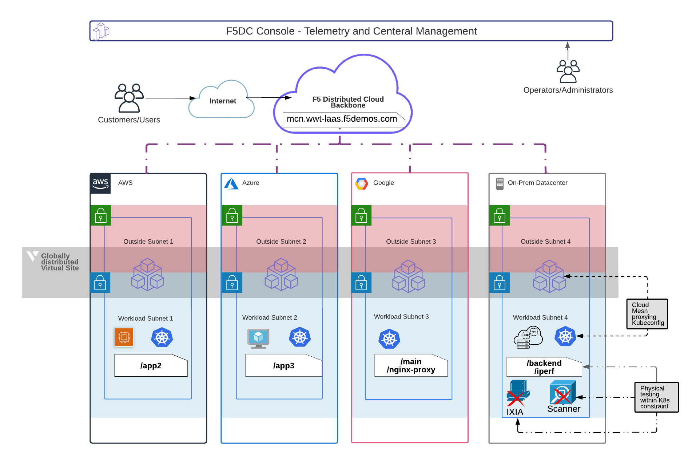

## Objective

The objective of this exercise is to demonstrate the use of F5 Distributed Cloud Services platform (F5XC Services) to manage & secure the cloud-to-cloud connectivity for microservices based application deployed in a distributed cloud framework. We used a finance application consisting of four microservices and the services were distributed across four customer edge (CE) sites deployed in AWS, Azure, GCP & VMware environments. 

F5 leverages WWT's Advanced Technology Center to demonstrate multi-oem integrations, proof of concepts for customers etc. As a part of this engagement, WWT's ATC was utilised to setup the VMware customer edge (CE) site and the backend component of the application was deployed in the on-prem K8s cluster.

This runbook/guide should provide you artifacts to explore the Multi-Cloud Netowrking (MCN) use-cases of the XC. 

We will be addressing the below use cases:

- MCN Cloud-to-Cloud via HTTP Load Balancer (Layer 7);
- MCN Cloud-to-Cloud security via Service policies (Layer 3 & Layer 7);
- API discovery, analytics & observability

The runbook/guide will walkthrough the configuration of F5XC Services via SaaS platform that should be beneficial for a NetOps persona, we will also be providing terraform automation scripts to build the necessary configs which can be utilised by a DevOps persona and incroporate this configs as part of robust pipelines.

## Pre-requisties

- Access to F5 Distributed Cloud Account
- Access to various cloud providers like GCP, AWS, Azure
- Access to vSphere server to create the On-Prem site
- Delegated DNS Sub domain to F5 Distributed Cloud

If you are using your laptop to eXCute the deployment code, you will need the below tools installed before proceeding.

- [AWS CLI](https://docs.aws.amazon.com/cli/latest/userguide/getting-started-install.html)
- [Azure CLI](https://docs.microsoft.com/en-us/cli/azure/install-azure-cli-linux?pivots=apt)
- [gcloud CLI](https://cloud.google.com/sdk/docs/install)
- [kubectl](https://docs.aws.amazon.com/eks/latest/userguide/install-kubectl.html)
- [eksctl](https://docs.aws.amazon.com/eks/latest/userguide/eksctl.html)
- [Postman](https://www.postman.com/downloads/)

!!! Note

    The Runbook/Guide uses macbook terminal, please substitute these commands as per the operating system of your local client machine

## Customer Scenario

Organization XYZ has a finance application deployed on-prem, the application consisted of four microservices deployed in a K8s cluster . Although, the application was serving well for a small number of customers, it did not provide redundancy or fast response times to its end users. To resolve these underlying issues, the development team decided to distribute the application across various cloud providers with the objective of keeping the backend component on-prem, so the team decided to host Main App in GCP, App2 (Money Transfer app) in AWS, App3 (Refer a Friend) in Azure while hosting the Backend App in the on-prem cluster. Once the application was distributed and deployed in various cloud providers, building the components was a huge uplift and was time consuming requiring different skill sets to manage these cloud providers. The team had to build complex IPsec tunnels, manage the IP address blocks for these sites, setup BGP routing and define security policies relevant to each cloud provider etc. The team was looking for a solution that can abstract the underlying complexities and simplify the management & security across cloud providers, this is where we will be leveraging the F5XC Services global virtual network and connect all four sites together.

## Application overview and CE sites

As mentioned before, finance app has fours microservices and the team has decided to distribute them to below cloud providers.

- **Main App**, this is the front-end application that is interacting with other microservices to gather and display data to end users. Main App will be hosted in *GCP cloud via App Stack Cluster using virtual K8s cluster* provided by the F5 CloudMesh Node.
- **App2**, this is the money transfer component of the application interacting with front-end and backend apps, exposes APIs to transfer money between user accounts. App2, will be hosted in customer’s *existing EKS cluster* and connects to F5XC Services via AWS VPC Sites.
- **App3**, this is refer a friend component of the application, interacts only with the front-end. App3, will be hosted in customer’s *existing AKS cluster* and connects to F5XC Services via Azure VNET Site.
- **Backend**, this is the backend database component of the application interacting with front-end and app2. Backend will be hosted in customer’s existing *On-Prem environment* in a three node K8s cluster deployed on ESX host and connects to F5XC Services via Site registration process.

*High Level MCN architecure diagram*

The diagram above represent a *High Level view* of the architecture, each of the cloud provider will have cloudmesh nodes installed at the CE site that will facilitate the connectivity & security with the F5XC Services global network.

The CE sites will consist of below infrastrucutre.

- A dedicated On-Prem VMware vApp with three node K8s cluster.
- AWS subscription with EKS cluster and permissions to deploy the F5 CloudMesh Node.
- Azure subscription with AKS cluster and permissions to deploy the F5 CloudMesh Node.
- Google subscription with permissions to deploy the F5 CloudMesh Node and utilize the virtual K8s cluster provided by the F5XC Services via App Stack Cluster

## Deploying the Solution

WWT has a *dedicated tenant* on the F5XC Services platform with sufficient privileges to deploy and configure the necessary configuration objects like cloud credentials, origin pools, HTTP load balancers etc. to expose these microservices to the outside world.  We can also work with our customers to have their microservices exposed via F5XC Services either in a restricted environment or to internet and have users access these services and gather feedback on various metrics.

Below we will showcase deploying the MCN solution via **F5XC Services SaaS console** and later provide you **terraform scripts** and steps to **automate** this infrastructure.

Let's start by deploying the MCN to GCP, followed by AWS, Azure , On-Prem cluster and then use *nginx proxy* to tie all the distributed services and host via XC platform.

[App Stack creation with GCP Cloud](./clouds/gcp_cloud.md)

[Cloudmesh in AWS to manage app deployed in EKS cluster](./clouds/aws_cloud.md)

[Cloudmesh in Azure to manage app deployed in AKS cluster](./clouds/azure_cloud.md)

[Cloudmesh in VMware (on-prem) to manage app deployed in K8s cluster](./clouds/vmware.md)

[Deploy NGINX Proxy to bring all app components together](./clouds/proxy_lb.md)

[API Discovery](./clouds/api_discovery.md)

[Service Policies](./clouds/service_policies.md)

[Automating the Infrastructure deployment using terraform](./terraform/automation.md)

## Conclusion

As you saw we took a microservices based application and distributed it across the public and private clouds and brought together all the pieces of application to work as a single application using the F5XC platform, the platform was used to manage the multi kubernetes environment. We also applied service policies to provide a uniform layer of security to protect the application against various vulnerabilities. As the application traffic traversed the F5XC platform, we also observed the capabilities around AI&ML and how easily we were able to generate API graphs and discover all the API endpoints, we were also able to download the Open API swagger file.

We also observed how easy it was to stand up a CE(Customer Edge) site and have it registered on the F5XC global Network, all the complexities around creation of IPsec tunnels, BGP routing, security policies etc. were abstracted by the platform via the use of CloudMesh Nodes. The use of App Stack on the GCP provider allowed us to use the Virtual K8s cluster and deploy the apps right at the edge.

F5XC Services platform is a powerful SaaS based platform that can elevate and simplify the multi-cloud configurations, the API first based approach will help DevOps and SecOps teams in building robust CI/CD pipelines to deploy, manage and secure their multi-cloud environments.

You can find the reference links here [References](clouds/references.md)