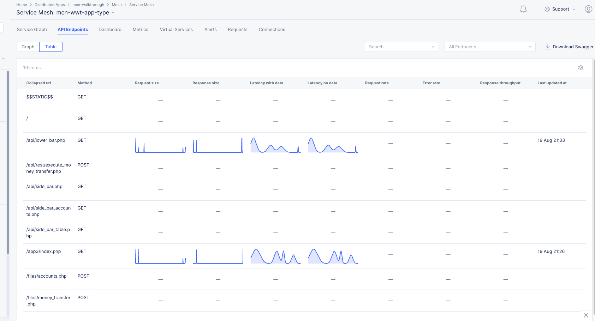

### API Discovery

As API's are becoming the focal point of digital economy their growth has been exponential, organizations have been taking the API first approach and developing new API's at a very rapid pace. As the number of applications grows, it becomes very difficult to answer some basic questions like, how many API's do we have, how is the API landscape expanding etc. and as the saying goes, you can't protect what you can't see, so you need a matured solution to respond to these queries and protect your API workloads. Here F5XC with its robust **AI & ML** capabilities provide a comprehensive way of analyzing API's in terms of *Service Graphs*, *API Endpoint table* and other ways that you will be exploring in this section.

In this section we will be doing API discovery by creating *App Type object* in *Shared* namespace and creating an *Add App Setting* for *mcn-walkthrough* namespace, these labels will then be applied to HTTP Load Balancers to monitor the traffic and observe the API endpoints. We will also be collecting the Swagger File at the end.

#### Step 1: Add App Type in Shared Configuration

1. Log into the F5XC using your tenant credentials and navigate to **Shared Configuration**

2. Now under **Security**, click on **AI & ML** and **+ Add App Type**. Create the object with name **mcn-wwt-app-type**, it should look like below snap.

*Enable the features for Application Type*


*When object creation is complete*

#### Step 2: Add App Setting in mcn-walkthrough namespace

1. Now navigate to **Distributed Apps**

2. Make sure you are in appropriate namespace **mcn-walkthrough**, navigate to **Manage** and click on **AI & ML**

3. Click on **+ Add App Setting** and create an object **mcn-wwt-app-setting** object, it should appears as below image.


#### Step 3: Apply App Type to all the Load Balancers

Now that we have the **App Type object** & **App Type setting**, lets apply this to the Hub & Spoke Load Balancers.

1. Still under **Distributed Apps**, navigate to **Manage** >> **Load Balancers** and click on **HTTP Load Balancers**

2. Now lets apply the setting to all these load balancers, click on  under **Actions** column, then click on **Manage Configuration**.


A Load Balancer screen opens, then on the right hand side top, click on , now under **Labels**, apply a new label as per below image.


*Label Selection*


*Select **Custom Value***

At the bottom of the page, click on **Save and Exit**, this should now successfully apply the label to the load balancer and enable us to collect the data necessary to build the API graph.

Repeat the above procedure to all the load balancer objects.


#### Step 4: Generate Traffic using JMeter or any other tool

We will be leveraging JMeter to send continuos traffic to our **HTTP Load Balancers** to generate the **API Graph** and Swagger files.

The test plan can be found at [TestPlan.jmx](https://github.com/sh271011/wwt-f5-mcn-poc/tree/master/docs/Test%20Plan)


The above test plan is continuously sending API calls to the **Arcadia application** over a period of 2 hours, the API calls are sent by 10 users to make transactions like buying and selling the stocks, executing the money transfer.

Below are the API calls that the test plan is leveraging.

```.json
POST https://mcn.wwt-lab.wwtatcdemos.com/trading/rest/buy_stocks.php

Body:
{
	"trans_value":12,
	"qty":16,
	"company":"MSFT",
	"action":"buy",
	"stock_price":198
}
```

```.json
POST https://mcn.wwt-lab.wwtatcdemos.com/trading/rest/sell_stocks.php

Body:
{
	"trans_value":212,
	"qty":16,
	"company":"MSFT",
	"action":"sell",
	"stock_price":158
}
```

```.json
POST https://mcn.wwt-lab.wwtatcdemos.com//api/rest/execute_money_transfer.php

Body:
{
    "amount":32,
    "account":2075894,
    "currency":"EUR",
    "friend":"Bart"
}
```

```.json
GET https://mcn.wwt-lab.wwtatcdemos.com/app3
```


#### Step 5: Observe the graphs under Service Mesh

Once the traffic is generated, lets navigate to **Mesh** >> **Service Mesh**


Now click on **mcn-wwt-app-type** and navigate through the various tab to observe the below graphs.


*Service Graph*


*API Endpoint Graph*


*API Endpoint Table*


*API Endpoint Graph for App2 LB*


*API Endpoint Graph for App3 LB*


*API Endpoint Graph for Backend LB*

#### Step 6: Download the Swagger file

Once you have the API's discovered, you can easily download the swagger file by navigating to **Service Mesh** >> **API Endpoints** and to the far right click on **Download Swagger**


You can find the swagger file [Swagger File](https://github.com/sh271011/wwt-f5-mcn-poc/tree/master/docs/Swagger%20File).

Organizations can use this swagger files to build, document, test and consume RESTful web services. Additional reading to understand details about swagger files can be done [Here](https://swagger.io/docs/specification/2-0/what-is-swagger/)


You can explore below **WWT ATC Labs** to understand how to implement **API Security** as part of CI/CD pipeline using NGINX Plus with App protect and DDoS capabilities.

- [API Security With NGINX Plus Using GitOps Workflow](https://www.wwt.com/lab/api-security-with-nginx-plus-using-gitops-workflow)
- [API Security: Declarative AWAF Policy Lifecycle in a CI/CD Pipeline Lab](https://www.wwt.com/lab/declarative-awaf-policy-lifecycle-in-a-cicd-pipeline)
- [API Security with OAuth2.0 using JWT Tokens](https://www.wwt.com/lab/apisecuritywithoauth2usingjwttokens)
- [WAAP for Open Banking Lab](https://www.wwt.com/lab/waap-for-open-banking)