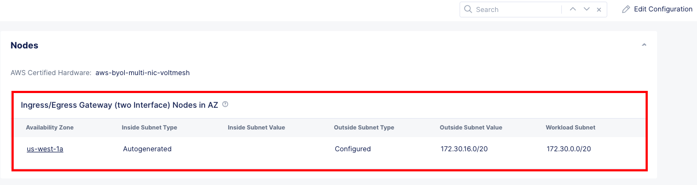
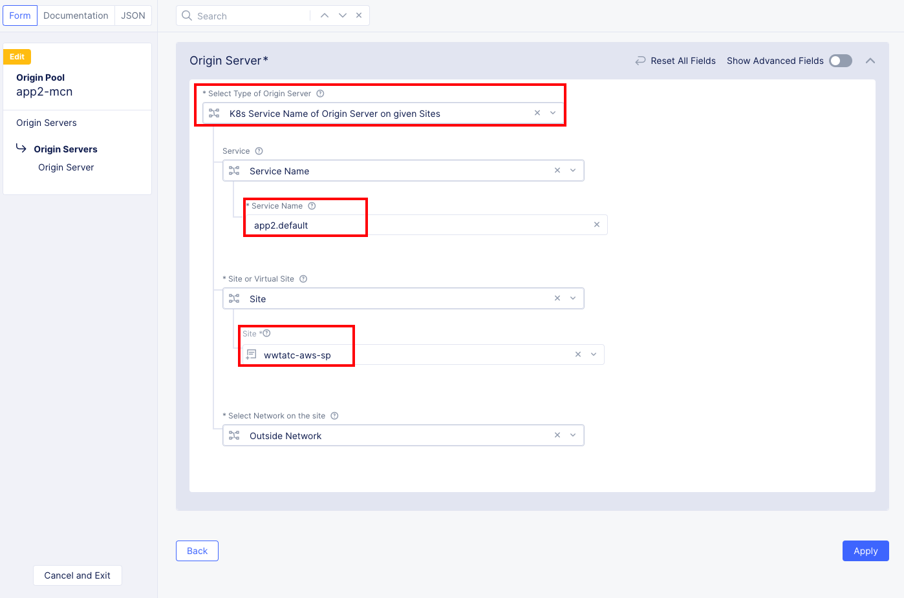
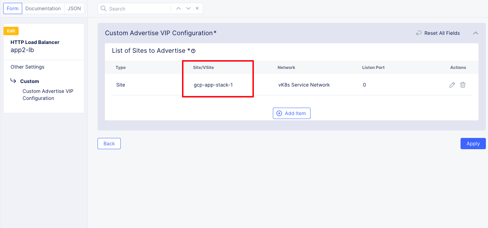

### Cloudmesh in AWS to manage app deployed in EKS cluster

Here we will be seeing the procedure to deploy the cloudmesh node in AWS cloud.

Follow the below steps by replacing the variable values as per your environment.

#### Step 1: Creation of Cloud Credentials IAM role in AWS

This step explains the various types of required policies that grant permissions for users to create or modify resources as part of deploying F5 Distributed Cloud® Sites on AWS. It provides instructions to create a service account using the AWS cloud formation templates.

We will be using the steps in the github repo [How-to create Service Accounts in AWS to provision F5XC Services AWS VPC or TGW site](https://gitlab.com/volterra.io/cloud-credential-templates/-/tree/master/aws) to create the needed service account for AWS.

Please follow the below steps to create the AWS service account.

1. Clone the **GitLab** repo to your client machine.
   
```.bash
shahapus@C02C8J4UMD6M ~ % git clone https://gitlab.com/volterra.io/cloud-credential-templates.git
Cloning into 'cloud-credential-templates'...
remote: Enumerating objects: 290, done.
remote: Counting objects: 100% (124/124), done.
remote: Compressing objects: 100% (103/103), done.
remote: Total 290 (delta 49), reused 58 (delta 21), pack-reused 166
Receiving objects: 100% (290/290), 54.12 KiB | 13.53 MiB/s, done.
Resolving deltas: 100% (135/135), done.
```

2. Change the directory to **aws** folder and setup the environment variables.
   
```.bash
shahapus@C02C8J4UMD6M ~ % cd cloud-credential-templates/aws 
shahapus@C02C8J4UMD6M aws % export AWS_ACCESS_KEY_ID=xxxxxxxxxxxxxx
shahapus@C02C8J4UMD6M aws % export AWS_SECRET_ACCESS_KEY=xxxxxxxxxx
shahapus@C02C8J4UMD6M aws % export AWS_DEFAULT_REGION=xxxxxxx
```

3. Execute the below command to create the **aws cloudformation** stack.

```.bash
shahapus@C02C8J4UMD6M aws % aws cloudformation create-stack --stack-name wwtatc-mcn-aws \
--template-body file://./aws-vpc-site-service-account.yaml \
--parameters file://./parameters.json --capabilities CAPABILITY_NAMED_IAM
```

4. Use **aws cloudformation describe-stack** command to get the details of the stack created in Step 3:

```.json
shahapus@C02C8J4UMD6M aws % aws cloudformation describe-stacks --stack-name wwtatc-mcn-aws
{
    "Stacks": [
        {
            "StackId": "arn:aws:cloudformation:us-west-2:081468640512:stack/wwtatc-mcn-aws/4a7ff820-fd59-11ec-b213-0a215704b641",
            "StackName": "wwtatc-mcn-aws",
            "Description": "AWS service account with required policy and permissions to deploy F5XC Services AWS VPC site",
            "Parameters": [
                {
                    "ParameterKey": "PolicyName",
                    "ParameterValue": "F5XC ServicesServiceAccountPolicyForAWSSite"
                },
                {
                    "ParameterKey": "Password",
                    "ParameterValue": "****"
                }
            ],
            "CreationTime": "2022-07-06T18:27:28.597000+00:00",
            "RollbackConfiguration": {},
            "StackStatus": "CREATE_COMPLETE",
            "DisableRollback": false,
            "NotificationARNs": [],
            "Capabilities": [
                "CAPABILITY_NAMED_IAM"
            ],
            "Outputs": [
                {
                    "OutputKey": "SecretKey",
                    "OutputValue": "**********",
                    "Description": "AWS Secret Access Key of new user"
                },
                {
                    "OutputKey": "UserName",
                    "OutputValue": "wwtatc-mcn-aws-SAUser-104FW63ZQA71G",
                    "Description": "AWS User name of new user"
                },
                {
                    "OutputKey": "AccessKey",
                    "OutputValue": "*********",
                    "Description": "AWS Access Key of new user"
                }
            ],
            "Tags": [],
            "EnableTerminationProtection": false,
            "DriftInformation": {
                "StackDriftStatus": "NOT_CHECKED"
            }
        }
    ]
}
```
Copy the AccessKey and the SecretKey from the Outputs section of the resulting JSON and save it in notepad.

The Access Key and the Secret Key can be used to create the **AWS Programmatic Access Credentials** on **F5XC Services Console**.

Verify the cloud credentials were created in AWS by logging in your **AWS account**


#### Step 2: Creation of Cloud Credentials in F5XC tenant

Cloud credentials are used to access services provided by AWS, Azure, and GCP to create, read, update, or delete objects needed to deploy and manage your applications in public cloud environments via F5 Distributed Cloud Services automation.

!!! Note
    
    Completion of **Step 1** is mandatory to proceed.

We will be using the steps from [AWS Programmable Access Credentials
](https://docs.cloud.f5.com/docs/how-to/site-management/cloud-credentials#aws-programmable-access-credentials) to create the AWS cloud credentials.

1. Log into **F5XC tenant** using your tenant credentials. Once logged in click on **Cloud and Edge Sites**
2. Now navigate to **Manage** >> **Site Management** >> **Cloud Credentials** and click on **+ Add Cloud Credentials**. Fill in the details as per below image.
. Click **Save and Exit**
3. Once you have successfully created the cloud credentials it will look similar to the below snap.


!!! Note

    Make sure you use the **Access Key ID** and **Secret Access Key** that was derived from the **aws described stack** command in Step 1.


#### Step 3: Creation of AWS VPC Site in F5XC tenant

In this step we will be leveraging the cloud credentials object **wwtatc-mcn-aws** to create the **AWS VPC site**

An AWS Virtual Private Cloud (VPC) site automates the deployment of sites in AWS. As part of the AWS VPC site configuration, you can indicate that new VPC, subnets, and route tables need to be created or specify existing VPC and subnet information. In case you specify existing VPC and subnet information, creation of VPC and subnet resources are skipped.

There are various ways to deploy the AWS VPC Site, but we will be using the **Ingress/Egress Gateway (Two Interfaces)** deployment.


For additional details on these deployment modes, refer [AWS VPC Site Deployment Types](https://docs.cloud.f5.com/docs/how-to/site-management/create-aws-site#aws-vpc-site-deployment-types).

To deploy the AWS VPC site, we will be leveraging the steps from [Create AWS VPC Site Object](https://docs.cloud.f5.com/docs/how-to/site-management/create-aws-site#create-aws-vpc-site-object).

1. Log into  **F5XC tenant** using your tenant credentials. Once logged in click on **Cloud and Edge Sites**
2. Now navigate to **Manage** >> **Site Management** >> **AWS VPC Sites** and click on **+ Add AWS VPC Site**.
Fill in the details as per below images.


Provide *Name* and *Description* 


Provide *vpc Name* and *IPV4 CIDR block*, Select *Ingress/Egress Gateway(Two Interface)* and click on *Configure* to provide *Node* details


Fill in *Node* details and provide *Outside and Worker* subnet details.


Make sure you select the *correct aws site*


Optionally, you can provide your client machine *Public Key*, so you can connect to *CloudMesh Node* if needed for troubleshooting

Click on **Save and Exit**

Next, you will need to [Deploy Site](https://docs.cloud.f5.com/docs/how-to/site-management/create-aws-site#deploy-site) by clicking on **Apply** in the **Actions** column.

After completion, you should see the site is **Applied**


!!! Note
    
    It might take 5 to 10 minutes to complete the site creation

Verify **Site Creation** by navigating to **Sites** >> **Site List**, here you should see the site transitioning through various stages from **Provisioning to Available**. Also verify the **Health Score** is **100**


Also login to your AWS subscription and observe the various configuration objects that gets created as part of AWS VPC Site creation.


#### Step 4: Setting up EKS cluster

In this step we will be deploying an EKS cluster to host our microservices based applications. Although there are many ways to deploy the EKS, we will be leveraging the [eksctl](https://docs.aws.amazon.com/eks/latest/userguide/getting-started-eksctl.html) command line utility to deploy the cluster.

To create the cluster navigate to directory **cloud-credential-templates/aws** and execute the below command from your client machine.

```.bash
eksctl create cluster \
--name wwtatc \
--version 1.21 \
--region us-west-1 \
--nodegroup-name wwtatc \
--node-type m4.large \
--nodes 3
```

The above command will create the managed EKS control plane, deploy 3 worker nodes along with the new VPC, IAM roles, NAT Gateways and all the necessary configs to support the cluster by creating a series of **CloudFormation** templates.

You can login to your **AWS** subscription and observe the **CloudFormation** templates that are created automatically when you execute the above command.


Once the command execution is complete, you should see the below terminal output.

```.bash
2022-08-03 18:20:33 [ℹ]  eksctl version 0.104.0
2022-08-03 18:20:33 [ℹ]  using region us-west-1
2022-08-03 18:20:33 [ℹ]  setting availability zones to [us-west-1a us-west-1c]
2022-08-03 18:20:33 [ℹ]  subnets for us-west-1a - public:192.168.0.0/19 private:192.168.64.0/19
2022-08-03 18:20:33 [ℹ]  subnets for us-west-1c - public:192.168.32.0/19 private:192.168.96.0/19
2022-08-03 18:20:33 [ℹ]  nodegroup "wwtatc" will use "" [AmazonLinux2/1.21]
2022-08-03 18:20:33 [ℹ]  using Kubernetes version 1.21
2022-08-03 18:20:33 [ℹ]  creating EKS cluster "wwtatc" in "us-west-1" region with managed nodes
2022-08-03 18:20:33 [ℹ]  will create 2 separate CloudFormation stacks for cluster itself and the initial managed nodegroup
2022-08-03 18:20:33 [ℹ]  if you encounter any issues, check CloudFormation console or try 'eksctl utils describe-stacks --region=us-west-1 --cluster=wwtatc'
2022-08-03 18:20:33 [ℹ]  Kubernetes API endpoint access will use default of {publicAccess=true, privateAccess=false} for cluster "wwtatc" in "us-west-1"
2022-08-03 18:20:33 [ℹ]  CloudWatch logging will not be enabled for cluster "wwtatc" in "us-west-1"
2022-08-03 18:20:33 [ℹ]  you can enable it with 'eksctl utils update-cluster-logging --enable-types={SPECIFY-YOUR-LOG-TYPES-HERE (e.g. all)} --region=us-west-1 --cluster=wwtatc'
2022-08-03 18:20:33 [ℹ]  
2 sequential tasks: { create cluster control plane "wwtatc", 
    2 sequential sub-tasks: { 
        wait for control plane to become ready,
        create managed nodegroup "wwtatc",
    } 
}
2022-08-03 18:20:33 [ℹ]  building cluster stack "eksctl-wwtatc-cluster"
2022-08-03 18:20:35 [ℹ]  deploying stack "eksctl-wwtatc-cluster"
2022-08-03 18:21:05 [ℹ]  waiting for CloudFormation stack "eksctl-wwtatc-cluster"
2022-08-03 18:21:36 [ℹ]  waiting for CloudFormation stack "eksctl-wwtatc-cluster"
2022-08-03 18:22:36 [ℹ]  waiting for CloudFormation stack "eksctl-wwtatc-cluster"
2022-08-03 18:23:37 [ℹ]  waiting for CloudFormation stack "eksctl-wwtatc-cluster"
2022-08-03 18:24:38 [ℹ]  waiting for CloudFormation stack "eksctl-wwtatc-cluster"
2022-08-03 18:25:39 [ℹ]  waiting for CloudFormation stack "eksctl-wwtatc-cluster"
2022-08-03 18:26:39 [ℹ]  waiting for CloudFormation stack "eksctl-wwtatc-cluster"
2022-08-03 18:27:40 [ℹ]  waiting for CloudFormation stack "eksctl-wwtatc-cluster"
2022-08-03 18:28:41 [ℹ]  waiting for CloudFormation stack "eksctl-wwtatc-cluster"
2022-08-03 18:29:42 [ℹ]  waiting for CloudFormation stack "eksctl-wwtatc-cluster"
2022-08-03 18:30:42 [ℹ]  waiting for CloudFormation stack "eksctl-wwtatc-cluster"
2022-08-03 18:32:48 [ℹ]  building managed nodegroup stack "eksctl-wwtatc-nodegroup-wwtatc"
2022-08-03 18:32:48 [ℹ]  deploying stack "eksctl-wwtatc-nodegroup-wwtatc"
2022-08-03 18:32:48 [ℹ]  waiting for CloudFormation stack "eksctl-wwtatc-nodegroup-wwtatc"
2022-08-03 18:33:19 [ℹ]  waiting for CloudFormation stack "eksctl-wwtatc-nodegroup-wwtatc"
2022-08-03 18:33:53 [ℹ]  waiting for CloudFormation stack "eksctl-wwtatc-nodegroup-wwtatc"
2022-08-03 18:35:44 [ℹ]  waiting for CloudFormation stack "eksctl-wwtatc-nodegroup-wwtatc"
2022-08-03 18:37:21 [ℹ]  waiting for CloudFormation stack "eksctl-wwtatc-nodegroup-wwtatc"
2022-08-03 18:37:21 [ℹ]  waiting for the control plane availability...
2022-08-03 18:37:21 [✔]  saved kubeconfig as "/Users/shahapus/.kube/config"
2022-08-03 18:37:21 [ℹ]  no tasks
2022-08-03 18:37:21 [✔]  all EKS cluster resources for "wwtatc" have been created
2022-08-03 18:37:22 [ℹ]  nodegroup "wwtatc" has 3 node(s)
2022-08-03 18:37:22 [ℹ]  node "ip-192-168-17-169.us-west-1.compute.internal" is ready
2022-08-03 18:37:22 [ℹ]  node "ip-192-168-30-11.us-west-1.compute.internal" is ready
2022-08-03 18:37:22 [ℹ]  node "ip-192-168-51-229.us-west-1.compute.internal" is ready
2022-08-03 18:37:22 [ℹ]  waiting for at least 3 node(s) to become ready in "wwtatc"
2022-08-03 18:37:22 [ℹ]  nodegroup "wwtatc" has 3 node(s)
2022-08-03 18:37:22 [ℹ]  node "ip-192-168-17-169.us-west-1.compute.internal" is ready
2022-08-03 18:37:22 [ℹ]  node "ip-192-168-30-11.us-west-1.compute.internal" is ready
2022-08-03 18:37:22 [ℹ]  node "ip-192-168-51-229.us-west-1.compute.internal" is ready
2022-08-03 18:37:24 [ℹ]  kubectl command should work with "/Users/shahapus/.kube/config", try 'kubectl get nodes'
2022-08-03 18:37:24 [✔]  EKS cluster "wwtatc" in "us-west-1" region is ready
```

Verify the cluster installation by navigating to **Amazon Elastic Service** resource in the AWS.


#### Step 5: Creating VPC peering between CloudMesh VPC and EKS VPC

Now that we have deployed the necessary infrastructure, we will need to create VPC peering between the CloudMesh and EKS cluster VPC's , this is needed so that the **F5XC** can discover the **K8S services** deployed in the cluster and configure necessary configuration objects to expose these applications to the external world.

To create the VPC peering navigate to the AWS **VPC resource** section and select anyone VPC and initiate the peering with other VPC.

Additional reading on [VPC Peering](https://docs.aws.amazon.com/vpc/latest/peering/what-is-vpc-peering.html) can be found here.

Once you complete the VPC peering, you should see a screenshot similar to below snap.


As you can see from above snap, the CloudMesh VPC with CIDR range **172.30.0.0/16** is initiating the pairing with EKS Cluster VPC with CIDR range **192.168.0.0/16**

You also need to setup the below routes, so that the VPC's know how to reach resources within each other.


**Route1:**

*Routes to allow CloudMesh VPC to access the EKS Cluster via peer link*

**Route2**

*Routes to allow EKS cluster communicate with CloudMesh Node via peer link*

**Route3:**

*Routes to access peer link*

#### Step 6: Creating a Service Account for EKS cluster

Once you have the EKS cluster deployed, you will need a service account to discover and deploy the applications to the cluster.

!!! Note
    
    The kubeconfig file to access the cluster should already have been downloaded and present at ~/.kube/config. You will be using this file to access the cluster initially and create service account.

Follow the below steps to create a service account and to build your kubeconfig file for service discovery.

1. Create the service account and bind the service account to grant cluster role by using the below command

```.bash
shahapus@C02C8J4UMD6M aws % kubectl create serviceaccount F5XC Services-sa
serviceaccount/F5XC Services-sa created

shahapus@C02C8J4UMD6M aws % kubectl create clusterrolebinding F5XC Services-sa-binding --clusterrole=cluster-admin --serviceaccount=default:F5XC Services-sa
clusterrolebinding.rbac.authorization.k8s.io/F5XC Services-sa-binding created
```

You now have a service account bound to the appropriate roles. To use this account, you need to get the token and its secret.

2. Retrieve the token associated with the account and locate the secret associated with the account.

The below command should return a list of secrets that looks something like this.

```.bash
shahapus@C02C8J4UMD6M aws % kubectl get secrets
NAME                  TYPE                                  DATA   AGE
default-token-zkpdp   kubernetes.io/service-account-token   3      13m
F5XC Services-sa-token-2bdf9   kubernetes.io/service-account-token   3      19s
```

Then use the kubectl describe command see the token in the secret. For example:

```.bash
shahapus@C02C8J4UMD6M aws % kubectl describe secret F5XC Services-sa-token-2bdf9
Name:         F5XC Services-sa-token-2bdf9
Namespace:    default
Labels:       <none>
Annotations:  kubernetes.io/service-account.name: F5XC Services-sa
              kubernetes.io/service-account.uid: 97ecaa00-f190-4381-89b4-2f9f610c489c

Type:  kubernetes.io/service-account-token

Data
====
namespace:  7 bytes
token:      ********************
ca.crt:     1066 bytes
```

The above command returns a description of the secret, which contains the token.

Now you have a service account with a long-lived token that you can use to authenticate to EKS cluster.

Using your existing kubeconfig, build a new kubeconfig using the service account token details.

You can refer this kubeconfig file [kubeconfig-aws-sa.yaml](https://github.com/sh271011/wwt-f5-mcn-poc/blob/master/docs/kubeconfigs/kubeconfig-aws-sa.yaml)

Also to understand the various K8s roles, please refer [K8s RBAC](https://kubernetes.io/docs/reference/access-authn-authz/rbac/)


#### Step 7: Deploying app2 in EKS cluster

Now that you have the service account with appropriate role, you can use the below command to deploy the app2.

```.bash
kubectl apply -f Arcadia-app2.yaml --kubeconfig kubeconfig-aws-sa.yaml
```

The manifests files are located here [Arcadia-app2](https://github.com/sh271011/wwt-f5-mcn-poc/blob/master/docs/Arcadia%20Manifests/Arcadia-app2.yaml)

You will need to use the kubeconfig that was generated in **Step 6**

Verify App2 is deployed and running.

```.bash
shahapus@C02C8J4UMD6M kubectl % kubectl get pods,svc --kubeconfig kubeconfig-aws-sa.yaml 
NAME                        READY   STATUS    RESTARTS   AGE
pod/app2-6fbbb86857-wd4hf   1/1     Running   0          18d

NAME                 TYPE        CLUSTER-IP      EXTERNAL-IP   PORT(S)        AGE
service/app2         NodePort    10.100.150.60   <none>        80:30362/TCP   18d
service/kubernetes   ClusterIP   10.100.0.1      <none>        443/TCP        18d
```

#### Step 8: Service Discovery

Service discovery is a way to discover the endpoints where a given service is available. You use can use these service endpoints and create configuration objects like origin pools.

The following figure shows the workflow for creating service discovery with Kubernetes service information:


Let's create a discovery object to discover the App2 services we deployed in Step 6.

1. Login to **F5 Distributed Cloud Console** using your tenant credentials
2. Create a discovery object in the System namespace by navigating to **Cloud and Edge Sites >> Manage >> Service Discoveries**, once here click on **Add Discovery**
3. In the **Add Discovery** layout, you will see **four** sections, fill out the sections as below.

**Metadata**, here you will provide the name for the object like *kube-aws-service-discovery*, it can be anything of your choice.

**Where**, Here you will select either *Virtual site* or *Site* or *Network*
*Virtual-Site or Site or Network* >> *Site*
*Reference* >> *wwtatc-aws-sp* (this site was created in Step 3)
*Network Type* >> *Site Local Network*

**Discovery Method**, Here you will select how you want to discover your service endpoints.
*Select Discovery Method* >> *K8S Discovery Configuration*
*K8s Discovery Configuration* >> Click on *Configure*
You will be redirected to **Access Credentials** page, In here fill the details as below.
*Select Kubernetes Credentials* >> *Kubeconfig*
*Kubeconfig* >> Click on *Configure*
You will be redirected to **Secret** Page, In here fill the details as below.
*Secret Info* >> *Blindfold Secret*
*Type* >> *Blindfold* , now paste in the *kubeconfig* you obtained in Step 6 and click on *Apply*
You will be redirected to **Access Credentials** screen, click *Apply* here and then finally click on *Save and Exit* towards the bottom of the main screen, this should successfully create a discovery object.

Once everything is complete, you should see something like below snaps.


*After setting up Service Discovery object*


*Access Credentials section of Service Discovery*

If the routing is setup properly and the F5XC is able to access the cluster, you should see the services discovered as below.


Now, click on **Services** under *Services* column, you should see all the services discovered in a cluster.


*Click on the Services to see all the deployed services in a EKS Cluster*


*View after clicking on Services highlighted in previous image*

This completes the creation of service discovery, for additional reading you can refer [Service Discovery](https://docs.cloud.f5.com/docs/how-to/app-networking/service-discovery-k8s)

#### Step 9: Creation of Origin Pool

Now that we have service discovery object created and services discovered, lets use this to create the **origin pools**

Origin pools are a way to declare the origin servers for your service in the load balancer configuration. You can create origin pools as part of HTTP load balancer creation or individually create and apply it to a HTTP load balancer later.

Please use the below steps to configure the Origin Pool with K8S Service Information.

1. Login to *F5 Distributed Cloud Console* using your tenant credentials and select *Load Balancers*
2. Make sure you are in the correct namespace.


Select *Manage >> Load Balancers* and click on *Origin Pools*


Now, select on *+ Add Origin Pool*

3. Once you are on the create origin pool page, you should see the below sections.

**Metadata**, Here you will provide details like name, labels and Description.
*Name* >> *app2-mcn*
*Description* >> *app2-mcn for LB*

**Origin Servers**, Here you will provide origin server details as below.

Now click on *Add Item*

**Port**, Here you will provide on which the application is running.
*Port* >> *80*

**Health Checks**, Here you will be creating a health check monitor to monitor the status of the application.
click on, *Add item* and click on *+ Create new Healthcheck* 

**Metadata**, here you will provide the name of the monitor
*Name* >> *http-check*
*Health Check Parameters*, here you will provide the health check parameters
*Health Check* >> *HTTP HealthCheck*, now click on *Configure* and provide the details as below.

Click on *Save and Exit*

You can leave all other configuration at their defaults and click on *Save and Exit*

This should successfully create the origin pool.

#### Step 10: Creation of HTTP Load Balancer

Now that we have an origin pool, we need to create a *HTTP Load Balancer* to expose this either internally or externally to access the *origin pool*

!!! Note
    
    Configuration of HTTP Load Balancer involves several settings, we will only highlight the configuration that is needed for this specific deployment, anything that is not mentioned below is assumed to have default values.

Follow the below steps to create the LB object.

1. Log into the F5XC console, click on *Load Balancers*
2. Select *Manage* >> *Load Balancers* >> *HTTP Load Balancers* and click on *+Add HTTP Load Balancer*
3. Configure metadata, domains and load balancer type.

In the *List of Domains* field, enter a domain name. You can use wildcards to catch prefixes and suffixes.
*Name* >> *app2-lb*

Click *Add item* to add more domains, if needed.
*List of Domains* >> *app2*

Select an option for the *Select Type of Load Balancer*.
*Load Balancer Type* >> *HTTP*
*HTTP Port* >> *0*

4. Configure Origins.
In the *Origin Pools* list, click *Add Item*. Fill in the details as below.
*Select Origin Pool Method* >> *Origin Pool*
*Origin Pool* >> *mcn-walkthrough/app2-mcn* (created in Step 9)
Leave everything else to default and click on *Add Item*

5. Configure how you want to advertise this LB, by navigating to *Other Settings*
*VIP Advertisement* >> *Custom*
*Custom* >> Click on *Configure*
You will not be redirected to **Custom Advertise VIP Configuration** Page
Under *List of Sites to Advertise* click on *+ Add item*
*Select Where to Advertise* >> *Site*
*Site Network* >> *Vk8S Service Network*
*Site Reference* >> *gcp-app-stack-1*
Click on *+Add Item*
Also, checkmark on *Add Location*

Since the frontend of Arcadia Application is hosted in GCP stack, we are advertising *App2* in the *GCP App stack*, so that the frontend can communicate with *app2* and build the application.

Finally, click on *Save and Exit*, this should now successfully create a *HTTP Load balancer* to expose *app2* of the *Arcadia Application*

Once everything is completed you should see something similar to below snap.


*here you will fill **Metadata**, **Domains and LB Type***


*Associate the correct origin pool*


*Other settings like where the VIP should be advertised, Load balancing algorithm etc.*


*In this case we are advertising the VIP only to GCP App stack, because the front end app needs to interact with app2 for data sharing etc.*

To understand and customize your deployment, please refer to [HTTP Load Balancer](https://docs.cloud.f5.com/docs/how-to/app-networking/http-load-balancer)

#### Step 11: Core DNS update

[CoreDNS](https://coredns.io/) is a flexible, extensible DNS server that can serve as the Kubernetes cluster DNS

If you analyse the way our microservices based *Arcadia app*, you will observe that *app2* has to interact with the *backend* component. To get the details of money transfer it is necessary for *app2* to resolve with the *backend* domain. By default, K8S cluster DNS settings does not have a way to resolve the *backend* domain, so we will be leveraging the *CoreDNS* to forward the dns queries for *backend* to be resolved by *F5XC*.

To updated the *CoreDNS* setting for *EKS Cluster* you will need to apply the *ConfigMap* as below

```.bash
kubectl apply -f eks-coredns-atcbld.yaml --kubeconfig kubeconfig-aws-sa.yaml
```

The manifests are located in the directory [EKS-files](https://github.com/sh271011/wwt-f5-mcn-poc/tree/master/docs/EKS-files)

We will use the Kubeconfig file that was obtained in **Step 6**.

By applying the above configMap, *app2* should now be able to resolve the *backend* domain.