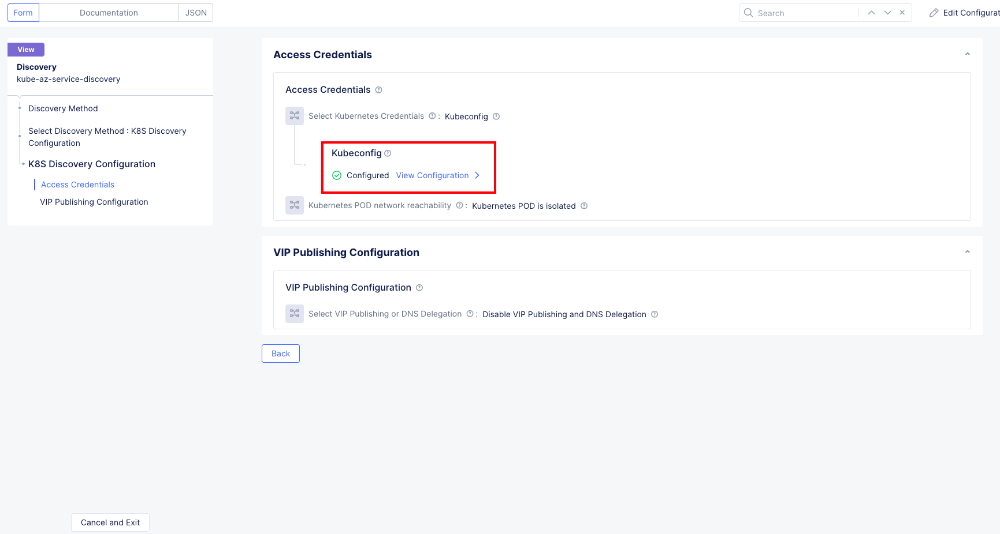

### Cloudmesh in Azure to manage app deployed in AKS cluster

In this section we will observe how to setup cloudmesh node in Azure, we will also be configuring the cloudmesh node to access the services deployed in AKS cluster.

To deploy the Azure MCN component, we will be using the below steps.

#### Step 1: Create Role and Service Principal

Perform the following steps to create a role in Azure portal with required permissions to create Azure VNET site and then create service principal subscription with contributor role for it.

We will be using the **GitLab** repo [How-to create Service Principal in Azure to provision F5XC Services Azure VNET site](https://gitlab.com/volterra.io/cloud-credential-templates/-/tree/master/azure) to create the service principal.

Follow the below steps.

1. Since you have already cloned the GitLab repo, just change the directory to **cloud-credential-templates/azure**

```.bash
shahapus@C02C8J4UMD6M % cd cloud-credential-templates/azure
shahapus@C02C8J4UMD6M azure %
```

2. Using a text editor of your choice update the file **F5XC Services-azure-custom-role.json** to include **"*/register/action"** additional permission for new subscriptions.

```.json
shahapus@C02C8J4UMD6M azure % vim F5XC Services-azure-custom-role.json
{
    "Name": "F5XC Services-azure-role",
    "IsCustom": true,
    "Description": "F5XC Services Custom Role to create Azure VNET site",
    "AssignableScopes": [
        "/subscriptions/$SUBSCRIPTION_ID"
    ],
    "Actions": [
        "*/read",
        */register/action",
        "Microsoft.Authorization/roleAssignments/*",
        "Microsoft.Compute/disks/delete",
        "Microsoft.Compute/virtualMachineScaleSets/delete",
        "Microsoft.Compute/virtualMachineScaleSets/write",
        "Microsoft.Compute/virtualMachines/delete",
        "Microsoft.Compute/virtualMachines/write",
        "Microsoft.Marketplace/offerTypes/publishers/offers/plans/agreements/*",
        "Microsoft.MarketplaceOrdering/agreements/offers/plans/cancel/action",
        "Microsoft.MarketplaceOrdering/offerTypes/publishers/offers/plans/agreements/write",
        "Microsoft.Network/loadBalancers/*",
        "Microsoft.Network/locations/setLoadBalancerFrontendPublicIpAddresses/action",
        "Microsoft.Network/networkInterfaces/*",
        "Microsoft.Network/networkSecurityGroups/delete",
        "Microsoft.Network/networkSecurityGroups/join/action",
        "Microsoft.Network/networkSecurityGroups/securityRules/delete",
        "Microsoft.Network/networkSecurityGroups/securityRules/write",
        "Microsoft.Network/networkSecurityGroups/write",
        "Microsoft.Network/publicIPAddresses/delete",
        "Microsoft.Network/publicIPAddresses/join/action",
        "Microsoft.Network/publicIPAddresses/write",
        "Microsoft.Network/routeTables/delete",
        "Microsoft.Network/routeTables/join/action",
        "Microsoft.Network/routeTables/write",
        "Microsoft.Network/virtualNetworks/delete",
        "Microsoft.Network/virtualNetworks/subnets/*",
        "Microsoft.Network/virtualNetworks/write",
        "Microsoft.Resources/subscriptions/resourcegroups/*"
    ],
    "NotActions": []
}
```

3. Run the Azure login command.

```.bash
shahapus@C02C8J4UMD6M azure % az login
```
The CLI opens your default browser and load an Azure sign-in page. Sign-in with your account credentials.

4. List the Azure accounts and subscriptions:

```.bash
az account list --output table
```
Get the desired Azure **SubscriptionId** from the output of above command.

5. Set the active account to the desired SubscriptionId:

```.bash
export SUBSCRIPTION_ID=<subscription_id>
az account set --subscription $SUBSCRIPTION_ID
```

6. Create the **Azure Custom Role** using the JSON file - *F5XC Services-azure-custom-role.json*:
   
```.bash
az role definition create --role-definition ./F5XC Services-azure-custom-role.json
```
- Replace the value of $SUBSCRIPTION_ID to the relevant **SubscriptionId** in the JSON file.
- Modify **Name** of the role in the JSON file if required (default custom role name is **F5XC Services-azure-role**).

7. Create the Service Principal and assign the custom role created on Step 6:

```.bash
az ad sp create-for-rbac --role="F5XC Services-azure-role" --scopes="/subscriptions/$SUBSCRIPTION_ID" --name "SP_NAME"
```
- **F5XC Services-azure-role** is the Custom Role created on Step 6
- **SP_NAME** is the service principal name that will be created.
- The resulting JSON output will be used to create **Azure Client Secret for Service Principal** on **F5XC Services Console**.

#### Step 2: Creation of Cloud Credentials in F5XC tenant

This is similar to **Step 2 from the AWS deployment**.

Please refer the link [Azure Client Secret for Service Principal Credentials
](https://docs.cloud.f5.com/docs/how-to/site-management/cloud-credentials#azure-client-secret-for-service-principal-credentials) to follow the steps to create the Azure cloud credentials.

Once you have successfully created the cloud credentials it will look similar to the below snap.


#### Step 3: Creation of AZ VNet Site in F5XC tenant

Now that we have the cloud credentials needed to deploy the CloudMesh node in Azure, lets work on deploying the Azure VNet site.

In this step we will be leveraging the cloud credentials object **wwtatc-mcn-az** to create the **Azure VNet site**.

You can refer [Azure VNet Deployment Types](https://docs.cloud.f5.com/docs/how-to/site-management/create-azure-site#azure-vnet-site-deployment-types) to understand the various deployment models available. We will be using [Ingress Gateway(One Interface)](https://docs.cloud.f5.com/docs/how-to/site-management/create-azure-site#ingress-gateway-one-interface) in our deployment.

    
Make sure you have completed the [Accept Subscription Agreement](https://docs.cloud.f5.com/docs/how-to/site-management/create-azure-site#accept-subscription-agreement) before creating the **Azure VNET Site**, else the site creation will fail with errors.

Once we are done with prerequisites, please use the below steps to create the **Azure VNet Site** object

The below deployment steps are specific to the environment we have already deployed as part of WWT MCN build. Customers can leverage the [Create Azure VNet Site Object](https://docs.cloud.f5.com/docs/how-to/site-management/create-azure-site#create-azure-vnet-site-object) document to perform configuration as per their own environments.

1. Log into the Console using your tenant credentials.
   - Click on **Cloud and Edge Sites**,
   - Click **Manage** > **Site Management**.
   - Click **Azure VNET Sites**.
   - Click **Add Azure VNET Site**.


2. In the **Metadata** section, enter a name and optionally select a label and add a description, as needed.
*Name* >> *wwtatc-az-sp** (name can be anything that matches the naming convention)

3. Configure site settings and VNet.
   - In the **Site Type Selection** section, perform the following:
     - Enter your Azure resource group in the **Resource Group** field. Ensure that you enter a name for a non-existent resource group. We have named the resource group as **wwtatc-F5XC Services-site**
     - Select a region type from the **Select Azure Region** Type menu. The **Recommended Azure Region Name** option is selected by default. We will use this default setting.
     - Select a region from the **Recommended Azure Region Name** menu per your choice of the Azure region type.We will use **westus2** region.

4. From the **Vnet** menu, select an option:
   - New Vnet Parameters: Select **Autogenerate Vnet Name**
   - In the **IPv4 CIDR block** field, enter a value. We used **172.27.0.0/16**

5. From **Select Ingress Gateway or Ingress/Egress Gateway**, select **Ingress Gateway (One Interface) on Recommended Region**, and perform the following
   - Click **Configure**.
   - Under the **Ingress Gateway (One Interface) Nodes in AZ** section, click **Add Item** and perform the following:
   - From the **Azure AZ name** menu, select an option to set the number of availability zones.
   - From the Subnet for local interface menu, select **New Subnet**
   - For the **New Subnet** option, enter the subnet address **172.27.0.0/22** in the IPv4 Subnet field.
   - Click **Add item**
Once everything is complete, your deployment should look like the below snap.


6. Set the deployment type.
   - From the **Automatic Deployment** drop-down menu, select **Automatic Deployment**.
   - Select an existing Azure credentials object **system/wwtatc-mcn-az**, or you can create new cloud credential object by referring Step 1

Leave everything else at default values and click on **Save and Exit**

7. Deploy Site
Creating the Azure VNet object in Console generates the Terraform parameters.
    - Navigate to the created Azure VNet object using the **Manage** > **Site Management** > **Azure VNET Sites** path.
    - Find your Azure VNet object and then click **Apply** in the Actions column. The **Status** field for your Azure VNet object changes to **Applying**.
    - Wait for the apply process to complete and the status to change to **Applied**.
    - Navigate to **Sites** > **Sites List**.
    - Verify status is **Online**. It takes a few minutes for the site to deploy and status to change to **Online**.

You can refer the below snaps from the ATC Build environment.


*Here you will provide the **Name** to the config object*


*Select the **Site Type**,**Ingress Gateway**, **Deployment Type***


*Select subnets in recommended region*


*optionally you can provide the public Key to connect the Node*

Once everything is complete, you can login to your Azure subscription and observe the various configuration objects that gets created as part of Azure VNet Site creation.


*Snap from Azure Subscription showing the resource group*


*Click on the Resource Group to observe other config elements*

As you can observe above, the **Azure VNet Site** creation, deploys all the resources including the VNet, routes, rules etc. to deploy the CloudMesh nodes in Azure.

#### Step 4: Setting up AKS Cluster

We will next deploy the AKS cluster that is needed to deploy the **App3** component of the **Arcadia Finance** application.

Although there are various ways to deploy the cluster, we will use the Azure portal guided configuration to deploy the AKS cluster.

Please refer the documentation [Deploy an Azure Kubernetes Service](https://docs.microsoft.com/en-us/azure/aks/learn/quick-kubernetes-deploy-portal?tabs=azure-cli)

For our specific deployment, you can refer the below parameters value.


You can also log into the Azure portal and observe the cluster status.


#### Step 5: VNet Peering

Now that we have the Azure Virtual networks for CloudMesh & AKS deployment. We need to perform VNet peering so that the resources can be accessible between the subnets.

Below are the two Virtual Networks.


Once you perform the peering you should see a snap similar to below.


*peering details*


*peering from cloudMesh to AKS vpc*


*peering from aks to cloudMesh*


*peering from AKS vpc to cloudMesh vpc*

You can refer the document [Virtual Network Peering in Azure](https://k21academy.com/microsoft-azure/az-303/azure-vnet-peering/) to understand the details about VNet Peering.

#### Step 6: Creating a Service Account for AKS cluster

Similar to how we created the SA for AWS, we will be essentially repeating the same steps to create a new SA for AKS cluster.

```.bash
shahapus@C02C8J4UMD6M azure % kubectl create serviceaccount F5XC Services-az
serviceaccount/F5XC Services-az created
shahapus@C02C8J4UMD6M azure % 
shahapus@C02C8J4UMD6M azure % kubectl create clusterrolebinding F5XC Services-az-binding --clusterrole=cluster-admin --serviceaccount=default:F5XC Services-az
clusterrolebinding.rbac.authorization.k8s.io/F5XC Services-az-binding created
shahapus@C02C8J4UMD6M azure % 
shahapus@C02C8J4UMD6M azure % 
shahapus@C02C8J4UMD6M azure % 
shahapus@C02C8J4UMD6M azure % kubectl get secrets                                                                                          
NAME                  TYPE                                  DATA   AGE
default-token-kl5cq   kubernetes.io/service-account-token   3      3m43s
F5XC Services-az-token-7m54m   kubernetes.io/service-account-token   3      44s
shahapus@C02C8J4UMD6M azure % 
shahapus@C02C8J4UMD6M azure % 
shahapus@C02C8J4UMD6M azure % 
shahapus@C02C8J4UMD6M azure % kubectl describe secret F5XC Services-az-token-7m54m
Name:         F5XC Services-az-token-7m54m
Namespace:    default
Labels:       <none>
Annotations:  kubernetes.io/service-account.name: F5XC Services-az
              kubernetes.io/service-account.uid: 65148b94-4f94-4581-a2f2-0fb88118d11f

Type:  kubernetes.io/service-account-token

Data
====
token:      ****************************
ca.crt:     1761 bytes
namespace:  7 bytes
```

The kubeconfig file can be found at [kubeconfig-az-sa.yaml](https://github.com/sh271011/wwt-f5-mcn-poc/blob/master/docs/kubeconfigs/kubeconfig-az-sa.yaml)

#### Step 7: Deploying app3 in AKS cluster

Now that you have the service account with appropriate role, you can use the below command to deploy the app3.

```.bash
kubectl apply -f Arcadia-app3.yaml --kubeconfig kubeconfig-az-sa.yaml
```

The manifests files are located in the GitHub repository [Arcadia-app3](https://github.com/sh271011/wwt-f5-mcn-poc/blob/master/docs/Arcadia%20Manifests/Arcadia-app3.yaml)

You will need to use the kubeconfig file that was generated in **Step 6**

Verify App3 is deployed and running

```.bash
shahapus@C02C8J4UMD6M kubectl % kubectl get pods,svc --kubeconfig kubeconfig-az-sa.yaml 
NAME                       READY   STATUS    RESTARTS   AGE
pod/app3-575f757c4-szhnp   1/1     Running   0          20d

NAME                 TYPE        CLUSTER-IP    EXTERNAL-IP   PORT(S)        AGE
service/app3         NodePort    10.0.222.86   <none>        80:31662/TCP   20d
service/kubernetes   ClusterIP   10.0.0.1      <none>        443/TCP        20d
```

#### Step 8: Service Discovery

Service Discovery procedure remains same as that of AWS, we will be referencing the Azure VNet Site **wwtatc-az-sp** and use the kubeconfig file [kubeconfig-az-sa.yaml](https://github.com/sh271011/wwt-f5-mcn-poc/blob/master/docs/kubeconfigs/kubeconfig-az-sa.yaml) from **Step 6**

Once everything is complete, you should see something like below snaps.


*Fill in details like **Name**,**Select Site**,**Discovery Method***


*provide **kubeconfig** that was obtained earlier*

If the routing is setup properly and the F5XC is able to access the cluster, you should see the services discovered as below.


*Click on **Services***

Now, click on Services under Services column, you should see all the services discovered in a cluster.


*Observe **app3** service deployed in AKS cluster*

This completes the service discovery, for additional reading you can refer [Service Discovery](https://docs.cloud.f5.com/docs/how-to/app-networking/service-discovery-k8s)

#### Step 9: Creation of Origin Pool

Now that we have service discovery object created and services discovered, let use this to create the origin pools

We will follow the same procedure as before from AWS Step 9 and reference the appropriate site and service.

Once all the config is complete, you should see image similar to below.


*Fill in details like **Name**,**Origin Server***


*Select the correct site **wwtatc-az-sp***

#### Step 10: Creation of HTTP Load Balancer

Now that we have an origin pool, we need to create a HTTP Load Balancer to expose this either internally or externally to access the origin pool

We will follow the same procedure we used in AWS section Step 10.

!!! Note

    Configuration of HTTP Load Balancer involves several settings, we will only highlight the configuration that is needed, anything that is not mentioned below is assumed to have default values.

Once everything is complete your configuration should appear as below.


*Provide **Name** to the config object*


*Details like **Domain**, **Load Balancer Type***


*Origin pool, select the correct origin pool **app3-mcn***

To understand and customize your deployment, please refer to [HTTP Load Balancer](https://docs.cloud.f5.com/docs/how-to/app-networking/http-load-balancer)