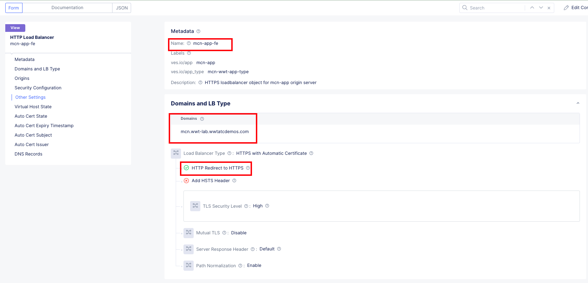

### Deploy NGINX Proxy to bring all app components together

Now that we have all the components of the **Arcadia App** deployed across various cloud providers, these services needs to be load balanced so they can interact with each other to build the complete web application. We will be leveraging **F5's NGINX Plus** here because of its lightweight footprint and easy deployment options in a microservices based architecture. You can refer [NGINX Deployment Guides](https://docs.nginx.com/nginx/deployment-guides/) to understand the various deployment options for NGINX.

The end goal of this exercise will be to create a front end load balancer that will load balance all other HTTP Load balancer exposing the various services of the application.

Just to refresh the memory, below is how the application is distributed.

**Main App** will be deployed in **GCP App Stack**
**Back End** will be deployed in **On Prem K8s cluster**
**App2** will be deployed in **EKS cluster**
**App3** will be deployed in **AKS cluster**

Let's follow the below steps to create the Front end load balancer object.

#### Step 1: Create a ConfigMap and deploy proxy Pod in GCP App Stack

Execute the below command to deploy the config in **GCP App Stack**

```.bash
kubectl apply -f nginx-proxy.yaml --kubeconfig ves_mcn-walkthrough_mcn-walkthrough-vk8s.yaml
```

The manifests file can be found in **docs** under [NGINX-files](https://github.com/sh271011/wwt-f5-mcn-poc/tree/master/docs/NGINX-files) directory

You can do additional reading to understand the **ConfigMap** by using the NGINX Plus documentation at [ConfigMap Resource](https://docs.nginx.com/nginx-ingress-controller/configuration/global-configuration/configmap-resource/)

Verify if the configmap & proxy pod is applied successfully.

```.bash
shahapus@C02C8J4UMD6M kubectl % kubectl get configmap --kubeconfig ves_mcn-walkthrough_mcn-walkthrough-vk8s.yaml
NAME         DATA   AGE
nginx-conf   1      19d

shahapus@C02C8J4UMD6M kubectl % kubectl get pod,svc --kubeconfig ves_mcn-walkthrough_mcn-walkthrough-vk8s.yaml 
NAME                         READY   STATUS    RESTARTS   AGE
pod/main-6766d4744d-gmvm9    2/2     Running   15         19d
pod/proxy-6c8c58bbd8-thgwt   2/2     Running   0          19d

NAME            TYPE        CLUSTER-IP       EXTERNAL-IP   PORT(S)   AGE
service/main    ClusterIP   192.168.252.15   <none>        80/TCP    39d
service/proxy   ClusterIP   192.168.194.48   <none>        80/TCP    19d
```


*Observe the **ConfigMap** under the **Virtual K8s** cluster*


*Under **Virtual K8s**, observe the deployed **Pods**, you should see **proxy***


*Similarly like above, check the **Services***


If you are interested in learning more on how **F5 NGINX** can help you with easily integrable lightweight solution for developing your *CI/CD pipelines* and also provide OWASP top 10 security features at the application deployment phase, please refer [WWT ATC NGINX content](https://www.wwt.com/partner/nginx), here you will find labs on some of the advanced NGINX use cases.

#### Step 2: Create a Origin Pool

Now that you have the proxy deployed, lets create the origin pool.

This will follow the similar procedure we have used before. It should look like below snap when done.


#### Step 3: Create the Front end HTTP Load Balancer

Let us now create the front end load balancer and expose the **Arcadia App** to the external world.

A valid DNS domain needs to be delegated to Distributed Cloud Services in case you want Distributed Cloud Services to act as domain name server (DNS). For instructions on how to delegate your domain to Distributed Cloud Services, see [Delegate Domain](https://docs.cloud.f5.com/docs/how-to/app-networking/domain-delegation).

In our deployment, we have delegated the domain **wwt-lab.wwtatcdemos.com** to the F5XC.


We will be customizing the deployment of HTTP Load Balancer as per our environment, if you want to learn and understand all the settings that are available to deploy the HTTP Load Balancer please refer [HTTP Load Balancer](https://docs.cloud.f5.com/docs/how-to/app-networking/http-load-balancer).

Please follow the below steps to create the HTTP Load Balancer.

1. As before navigate to **Load Balancers** >> **Manage** >> **Load Balancers** >> **HTTP Load Balancers** and click on **+ Add HTTP Load Balancer**
2. Fill in the details as per below images.


*As before fill in metadata details like Name,Domain and Load Balancer, carefully observe they are little different than previous lb deployments*


*Select the **proxy-mcn** pool*


*Observe the VIP deployment is **Internet**, so this can be accessible from anywhere, this is the front end Load Balancer*

Click on **Save and Exit**

Now you should have successfully created a HTTP Load balancer that will expose the **Arcadia Finance App** to external world via FQDN **mcn.wwt-lab.wwtatcdemos.com**

Fee free to browse through the application and observe the application appears below when loaded.

