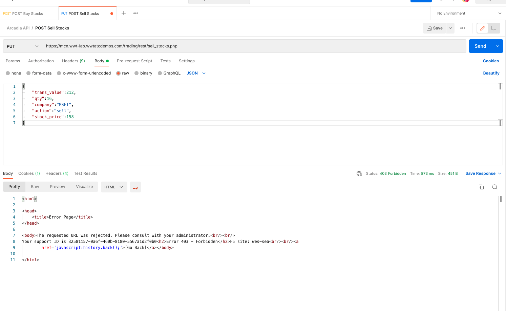

### Service Policies

Now that we have deployed our **Arcadia App** and exposed it externally, protecting this application against bad actors is necessary to provide the uptime and adequate functionality. We will be leveraging F5XC service policies to accomplish this task.

Service policies are configuration object within F5XC that can filter traffic on a wide variety of criteria, provide logging to view the nature of the request blocked and other metrics to help understand the nature of attacks.

Service policies are configuration objects used to protect applications against vulnerabilities.

A service policy can be configured in three different namespaces: system, shared, and app. We will be setting our policies in **Shared** namespace.

#### Step 1: Create OFAC(Office of Foreign Assets Control) service policy

OFAC(Office of Foreign Assets Control) is a financial intelligence and enforcement agency of the U.S. Treasury Department. It administers and enforces economic and trade sanctions in support of U.S. national security and foreign policy objectives. 

We are leveraging the list of banned actors from OFAC database and creating a policy to block access to known bad actors.

Please refer this [DevCentral article](https://community.f5.com/t5/technical-articles/how-to-use-f5-distributed-cloud-to-block-ofac-sanctioned/ta-p/292908) to further understand details about this policy.

In our deployment we will follow the below steps to create this policy.

1. As before navigate to **Shared Configuration** >> **Security** >> **Service Policies**
2. Click on **+ Add Service Policy** and create a service policy named **wwtatc-ofac-deny-sp1**, the policy appears as per below image.

*Path to create a service policy*

*OFAC service policy after creation is complete*

#### Step 2: Create HTTP Methods service policy

Most of the applications are designed to allow only specific HTTP Methods for security reasons, a bad actor can alter the database entries by using **PUT** method or gather other useful information about application using other HTTP Methods, hence limiting the HTTP Methods to only the allowed ones is very crucial in protecting the applications.

Let's create another policy called **http-methods-sp**, this policy only allows **GET & POST** methods and blocks all other HTTP Methods.

When configured the policy should look similar to below image.

*Policy **http-methods-sp** after creation*

*policy rules to allow only **GET & POST** http methods*

*two rules to Deny All methods and allow only **GET & POST** methods*

Service policy **OFAC** and **HTTP Methods** will be applied to the Front Proxy HTTP Load Balancer to protect the *North<>South* flow of traffic.

#### Step 3: Create Service policy specific to App2

Now lets create service policy specific to **App2** to manage the *East<>West* traffic between the various apps of the **Arcadia Finance application**

In this policy we will be allowing only **GET & POST** methods and allow only specific url's endpoints and block all other traffic.

Once your policy is built, it should appear similar to the below snaps.

***App2** policy after creation*

*policy rules*

*policy rules*

*allow specific urls relevant to app2*

*policy rules after completion*

#### Step 4: Create Service policy specific to App3

Like in Step 3, we will be creating policy specific to **App3** Application.

Once your policy is built, it should appear similar to the below snaps.

*policy layout*

*policy rules*

*policy rules to Allow specific http methods & URLs*

*policy rules to Allow specific http methods & URLs*

*policy rules to Allow specific http methods & URLs*

*rules after completion*

#### Step 5: Apply OFAC & HTTP Methods service policy to Proxy Load Balancer

Now that we have the services policies built, we will be attaching these policies to appropriate HTTP Load Balancers.

Let's apply **OFAC** and **HTTP Methods** to **mcn-app-fe** public facing Load Balancer.

You will need to **Edit Configuration**, browse to **Security Configuration** and apply the policies as below.

*Update Front end LB to apply the policies*

*Notice the order in which policies are applied*

Make sure you apply the service policies in the correct order.

!!! Note

    You can change the order of the policy by clicking the arrows in the policy boxes.

#### Step 6: Apply Service policy to app2-lb

Now let's apply service policy to **app2-lb**

Same as Step 5, you should see below snap when policy is applied successfully.

*Update **app2-lb** to apply the service policy*

*lb after policy is applied*

#### Step 7: Apply Service policy to app3-lb

Now let's apply service policy to **app3-lb**

*Update **app3-lb** to apply the service policy*

*lb after policy is applied*

#### Step 8: Test the service policies

Now that you have the service policies built and applied to all the relevant Load balancers, we will now be testing these service policies by sending **postman** calls and validating the service policies are functioning as expected.

1. **Test 1**  *Block request based on the source ip address*
In this test we will be sending a sample **postman** call to **buy stocks** from the *source address* that is supposed to be blocked due to malicious activity and observe the request is blocked by **wwtatc-ofac-deny-sp1** service policy.

*Postman call*

*Summary of logged request*

*Details of logs from F5XC Console*

2. **Test2**  *Block unwanted HTTP Methods*
In this test we will be sending a sample **postman** call to **sell stocks** and use **PUT** method, this request will be blocked by **http-methods-sp** service policy because its allowing only **POST & GET** methods.

*Postman call details*

You can access the F5XC logs by navigating thru **Distributed Apps** >> **Load Balancers** >> **Click on the Load balancer name**

Now using the *dropdown* change the view from **Performance Monitoring** to **Security Monitoring**

Click on **Security Events**

*Summary of logged request from F5XC Console*

*Details of logs showing which service policy blocked the request*

1. **Test3**  *Send API call to invoke the app2-lb service policy*
Here we are demonstrating the **app2-lb** policy for *East-West* traffic.

*Summary of logged request from F5XC Console*

*Details of logs showing which service policy the request passed through*