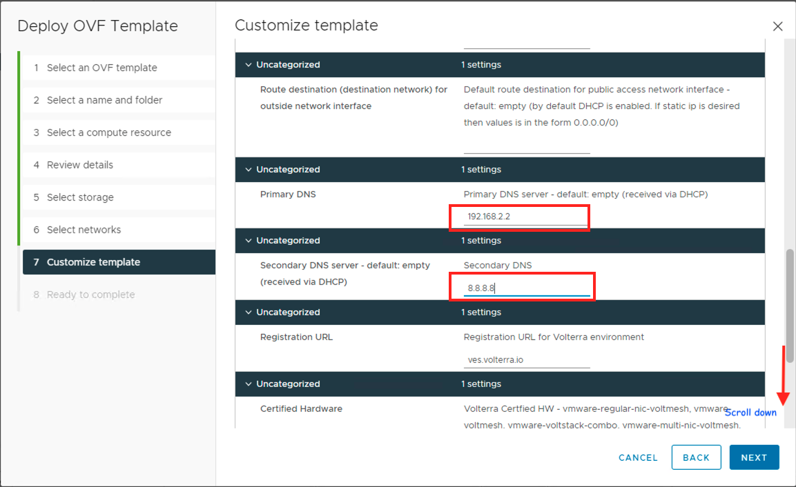

### Cloudmesh in VMware (on-prem) to manage app deployed in K8s cluster

In this section we will observe how we can leverage a VMware environment to deploy an on-prem CE site. WWT ATC's datacenter will be used to deploy the CE site. 

We will follow the below steps to complete the MCN deployment

#### Step 1: Clone vApp and setup the environment

This step involves setting up a vApp in WWT ATC environment with the necessary resources. This vApp will act as a on-prem CE(Customer Edge) site deployed on VMware environment.

The vApp is already built and stored as a **base template** with the below resources. This vApp can be leveraged by our customers to test out the solution.

|   Node   |    CPU    |  Mem |  HDD |
|----------|:-------------------:|------:|:-----|
| ESXi      |  8 vCPU | 32 GB  | 300 GB     |
| vCenter    | 4 vCPU | 16 GB  | 450 GB     |
| K8S Master |  2 vCPU | 4 GB | 32 GB  |
| K8S Worker 1 |  2 vCPU | 4 GB  | 32 GB  |
| K8S Worker 2 |  2 vCPU | 4 GB  | 32 GB  |
| Jumpbox-AD | 2 vCPU | 6 GB| 50 GB|

Below, we will be walking through the steps needed to setup the ATC base template and register that vApp template as a new **CE site** in your **F5XC tenant**.

1. Login to **F5XC Console** and click on **Cloud and Edge Sites**
2. Click on **Manage** >> **Site Management** >> **Site Tokens**

3. Create a new site token by clicking on **+ Add Site Token** and fill in the details.

4. Once the site token is created, make a note of the token details and keep it handy.

5. Clone the base template or create a new if needed depending on your environment.
6. Now power on the base template and wait for all the resources to fully boot up and come online.
7. Open chrome browser and open the **vSphere** client by clicking on the bookmark and login using the below credentials.

```
username: <your username>
password: <your password>
```
Once logged in you should see the below VM's

*List of VM's in the base template*

8. To create a new CE site, you will need to deploy a new OVF Template

*Click on Actions and select Deploy OVF Template*


*Select Local file and click on UPLOAD FILES to select the OVA template from local jumphost*


*Select the OVA image & click on Open*


*Verify the correct image was selected and click on NEXT*


*Update the Virtual machine name, In our case we named it as "atc-meshnode-01" , it can be anything you like*


*Click on NEXT*


*Click on NEXT*


*Select the checkbox for "esx01", from the dropdown select "Thin Provision", Click on NEXT*


*Click on NEXT*


*Update "Hostname", Input the "token value" obtained from Step 4, Update "Cluster Name" and scroll down to enter other values*


*Since we are using DHCP mode to allocate ip address to the CloudMesh Node, keep default values here & scroll down*


*Update "Primary DNS" & "Secondary DNS" values* 


*Depending on your current location, update the "Latitude" & "Longitude" values, these values will help in connecting the CE Site to the nearest RE Node in F5XC Global Network*


*Verify the properties vlaues and click on "FINISH"*

Once you click on **FINISH**, it should take few minutes for the OVA template to be imported and for the VM to be created. Once the process is complete you will see similar to the below image.


*Observe the "atc-meshnode-01" VM created*


*Powe On the CloudMesh Node*

You will have to wait few minutes until the Node is fully booted up.


*Once the Node is fully booted up, it should grab an "ip address" from the DHCP pool*


*Open a "Web Console" connection to the CloudMesh Node and login using username: admin, password: Volterra123*

After you login for the first time, you will need to change the password, use any password of your choice. Changing the password is **optional** and not a mandatory step for functoning of the CloudMesh Node.


*Login to F5XC Console, navigate to "Site Management" >> Registrations, check the pending registrations and click on "checkmark" to open the site registration page*


*Verify the details & Click on "Save and Exit"*

If everything checksout, the site should now start registering itself. It usually takes 15 to 20 minutes for registration to be complete.


*Click on "Site List" and observe the new site here, the "Health Score" will be "0" initially, wait for the score to reach "100", you check check the score by hitting the "Refresh" button*


*Observe here the Site is registered and has a "Health Score" of "100"*

Once the **Site** is up, you should see the **Health Score** reaching **100** and the status turn **green**, this should indicate your **VMware Site** is properly deployed as **CE(Customer Edge) Site** and part of the **F5XC platform**

You can refer the documentation [Create VMware Site](https://docs.cloud.f5.com/docs/how-to/site-management/create-vmw-site), this document to understand the detailed process of CloudMesh Node creation.

#### Step 2: Deploy backend app in K8s cluster

As part of the base template the three node **K8s cluster** is already deployed and setup. You should be able to launch **putty** terminal and connect to the **k8s-master** to access the cluster.


*snapshot of deployed **K8s Cluster VMs***


*Open PuTTY terminal and launch a session to **K8s-master***


*Verify the deployed app and services*

Now let's deploy the **backend** application in the **K8s cluster**

Use the below command

```.bash
ubuntu@k8s-master:~$ kubectl apply -f Arcadia-backend.yaml
service/backend created
deployment.apps/backend created
```

As before, you can find the manifests files at [Arcadia-backend](https://github.com/sh271011/wwt-f5-mcn-poc/blob/master/docs/Arcadia%20Manifests/Arcadia-backend.yaml)

Verify if the application is properly deployed and running.

```.bash
ubuntu@k8s-master:~$ kubectl get pods,svc -o wide
NAME                           READY   STATUS    RESTARTS   AGE    IP            NODE        NOMINATED NODE   READINESS GATES
pod/backend-79c6bcf85c-s7tqv   1/1     Running   0          109s   10.244.1.20   k8s-node1   <none>           <none>

NAME                 TYPE        CLUSTER-IP      EXTERNAL-IP   PORT(S)        AGE    SELECTOR
service/backend      NodePort    10.109.50.220   <none>        80:31584/TCP   109s   app=backend
service/kubernetes   ClusterIP   10.96.0.1       <none>        443/TCP        176d   <none>
```

In case if you have to setup your own **K8s Cluster**, this document [How to Install and Use Kubernetes on Ubuntu 20.04](https://www.cloudsigma.com/how-to-install-and-use-kubernetes-on-ubuntu-20-04/) should be helpful.

#### Step 3: Service Discovery

As before, we will be creating a discovery object in **F5XC tenant** to discover the **backend service** into F5XC platform.

1. Log into **F5XC tenant** using your tenant credentials and click on **Cloud and Edge Sites**
2. Click on **Manage** >> **Service Discoveries** and click on **+ Add Discovery**


Fill out the **discovery** template as below.


You will reference the **CE site** that you created in the previous step.


Select **Discovery Method** as **K8s Discovery Configuration** and click on **Configure**


Click on **Configure**

You will need the **kubeconfig** from the on-prem **K8s cluster** to create the discovery object. Get the config using the below command.

!!! Note

    This config will differ as per your deployment.

```.bash
apiVersion: v1
clusters:
- cluster:
    certificate-authority-data: <ca-data-here>
    server: https://your-k8s-cluster.com
  name: <cluster-name>
contexts:
- context:
    cluster:  <cluster-name>
    user:  <cluster-name-user>
  name:  <cluster-name>
current-context:  <cluster-name>
kind: Config
preferences: {}
users:
- name:  <cluster-name-user>
  user:
  user:
    client-certificate-data: <client-cert-data-here>
    client-key-data: <client-key-here>
```


Now still under **Secret** section, paste the **kubeconfig** file, click on **Blindfold** and then click on **Apply** and then again **Apply**

At the bottom of the screen click on **Save and Exit**

This should now successfully create the **Discovery object** and discover all the services deployed in the **K8s cluster**


*Click on **Services***


*Observe **backend.default** service is discovered from on-prem K8s cluster*

#### Step 4: Creation of Origin Pool

Like before, we will be creating an origin pool, it should appear as below.


#### Step 5: Creation of Load Balancer object


*Fill up details like **Name**,**Domain**,**Origin pool***


*VIP advertisement*


*Observe we are advertising the VIP to **GCP App Stack** and **AWS VPC Site**, since frontend app & app2 require access to backend*

Leave everything else to default values.